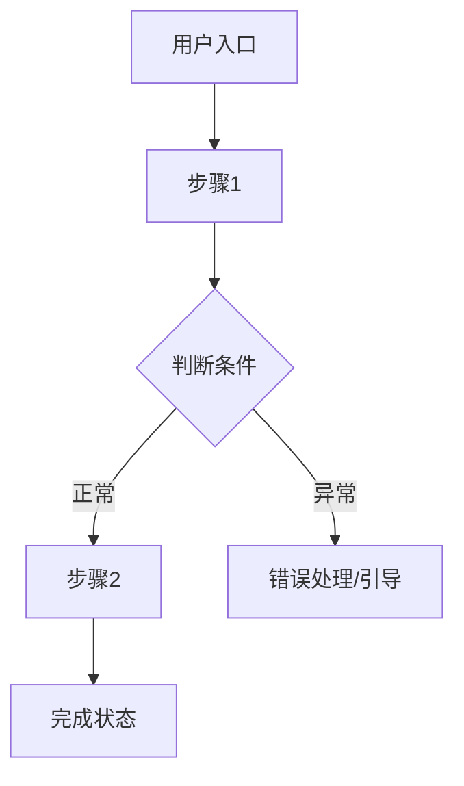

# 第二版 · 落地需求文档模板

**前提**：概念版已获用户 **明确确认**。

**路径**：`docs/YYYY-MM-DD-<主题>-PRD.md`

**文首元数据**（推荐）：

```markdown
> **文档类型**：落地需求文档（PRD）
> **概念版**：`docs/YYYY-MM-DD-<主题>-概念版.md`（已确认）
> **文档版本**：v1.0
> **范围说明**：MVP / V1.0（默认只展开 🔴 核心功能的 §5）
> **最后更新**：YYYY-MM-DD
```

---

## MVP 范围闸门（默认）

- **§5 功能详细描述** 默认只展开 **MVP / V1.0 的 🔴 核心功能**（以概念版、用户说明或 `docs/roadmap.md` 为准）
- 🟡 / ⚪ 仅在 §4 功能清单保留名称与一两句说明，**不写**完整 §5.x，除非用户要求全量
- 写 §5 前确认：「本期 MVP 共 N 个 🔴 功能，先写这些；其余是否下一版再展开？」
- `roadmap.md` 与概念版冲突时，列出冲突请用户裁定后再写 §5

---

## §1 产品概述

从概念版继承，直接复用，不重复追问。

## §2 目标用户与使用场景

- 用户画像（从概念版展开）
- 典型使用场景 2–3 个：**谁 / 什么情况 / 做什么 / 期望什么结果**

## §3 核心用户动线

用 Mermaid，至少主流程 + 1–2 异常分支。规则见 `diagram-handoff.md`。



## §4 功能清单

树状结构，🔴 核心 / 🟡 重要 / ⚪ 未来：

```
产品名称
├── 🔴 模块A（MVP 必须有）
│   ├── 功能1
│   └── 功能2
├── 🟡 模块B（后续迭代）
└── ⚪ 模块C（未来规划）
```

## §4.1 关键页面布局线框图

选 **1 个** 最核心页面，ASCII 画出骨架（导航、区域、视觉重心、覆盖层）。

**Web 后台示例：**

```
┌──────────────────────────────────────────────────────┐
│  [Logo]   顶部全局导航栏（用户 / 通知 / 设置）          │
├──────────┬───────────────────────────────────────────┤
│  左侧    │  面包屑 / 标题 + 操作按钮                    │
│  竖向    ├───────────────────────────────────────────┤
│  导航    │      主内容区（列表 / 表格）← 视觉重心       │
└──────────┴───────────────────────────────────────────┘
```

**移动小程序示例：**

```
┌─────────────────────┐
│  顶部搜索栏          │
├─────────────────────┤
│  Banner ← 强调区     │
├─────────────────────┤
│  推荐列表（卡片）     │
├─────────────────────┤
│ [首页][分类][我的]   │
└─────────────────────┘
```

## §5 功能详细描述

**每个 🔴 核心功能独立一节**，不合并、不省略。

### 5.x 功能名称

**功能描述**：解决什么问题，核心逻辑。

**触发条件**：用户何时进入/触发。

**交互细节**：

| 场景 | 交互处理方式 |
| --- | --- |
| 操作反馈 | loading / toast / 弹窗 / 骨架屏 |
| 危险操作确认 | 是否二次确认？文案？ |
| 空状态引导 | 无数据时展示什么？引导第一步？ |
| 操作失败引导 | 报错 + 下一步怎么做？ |

**状态清单**：

| 状态 | 触发条件 | UI 表现 | 用户可执行操作 |
| --- | --- | --- | --- |
| 默认 | 加载完成 | | |
| 加载中 | 触发操作后 | 转圈/骨架屏 | 不可重复触发 |
| 成功 | 操作完成 | 成功提示 + 更新 | |
| 失败 | 报错 | 红色提示 + 重试 | 重试 |
| 禁用 | 无权限/条件不满足 | 灰色 + tooltip | 仅查看 |
| 空状态 | 无数据 | 插图 + 引导 + 按钮 | 引导第一步 |

**边界条件**（逐项填写）：

- 内容为空 / 超长（上限）
- 网络异常或超时
- 无权限
- 并发操作同一条数据
- 数据格式不符

**多种内容类型**（若适用）：

| 内容类型 | 展示方式 | 特殊交互 | 加载/失败 |
| --- | --- | --- | --- |
| 图片 | 缩略图 + 放大 | 拖拽排序 | 破图占位 |
| PDF | 图标 + 文件名 | 预览/下载 | 失败提示 |

**数据规范**：

| 字段名 | 类型 | 长度/大小 | 必填 | 默认值 | 格式 | 校验 |
| --- | --- | --- | --- | --- | --- | --- |

**验收标准**（原型/测试向，推荐）：

- [ ] 用户完成 X 后，界面显示 Y
- [ ] 失败时出现 Z 文案且可重试

## §6 文案规范

**6.1 整体风格**（四选一或自定义）：专业严谨 / 亲切友好 / 简洁直接 / 轻松有趣

**6.2 面向开发/AI**：已在数据规范覆盖，不重复。

**6.3 面向终端用户**：

| 场景 | 文案内容 | 风格备注 |
| --- | --- | --- |
| 页面标题 | | |
| 空状态 | | 引导性 |
| 按钮 | | 动词开头 |
| 成功/错误/加载/危险确认 | | 错误须说明原因+下一步 |

按钮 ✅「开始创建」❌「确认」；错误 ✅「上传失败，超过 10MB，请压缩后重试」❌「上传失败」

## §7 非功能性需求

按产品类型从 `product-type-appendix.md` 选用补充项，至少覆盖：

- 性能（首屏、接口响应）
- 权限（登录、角色）
- 兼容性（设备、浏览器、系统）
- 数据安全与存储

## §8 待确认问题

- [ ] 问题（标明影响哪个功能/章节）
